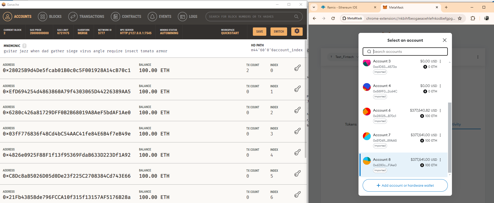
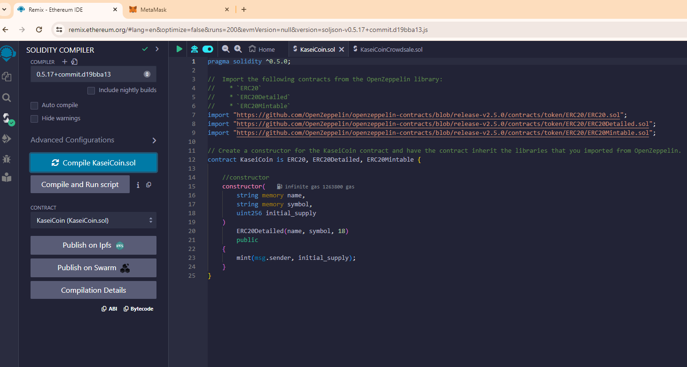
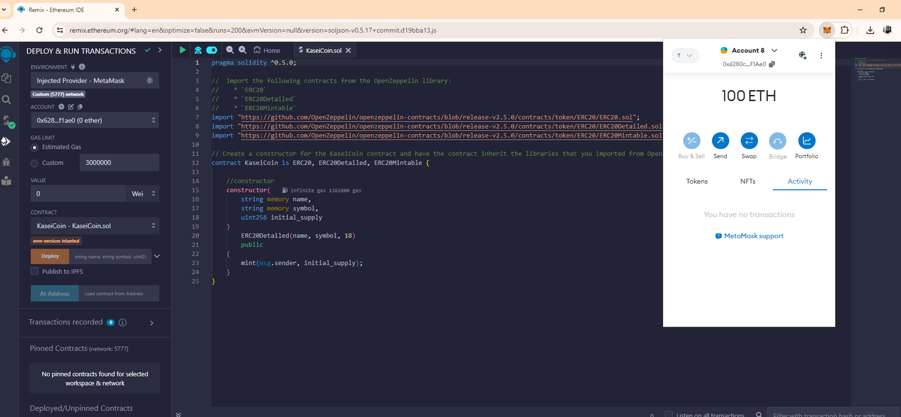

# KaseiCoin Crowdsale Project

## Background

KaseiCoin is a monetary system based on blockchain technology designed specifically for the future human colony on Mars. :)

## Overview

This project implements a token crowdsale for the KaseiCoin token using Solidity smart contracts. The project utilizes the OpenZeppelin library for ERC20 token functionality and crowdsale features.

## Smart Contracts

### KaseiCoin.sol

This contract implements the KaseiCoin token using the ERC20 standard. It includes features such as token name, symbol, decimals, and initial supply. Additionally, it inherits from OpenZeppelin's ERC20, ERC20Detailed, and ERC20Mintable contracts.

### KaseiCoinCrowdsale.sol

The KaseiCoinCrowdsale contract facilitates the token sale process. It inherits from OpenZeppelin's Crowdsale and MintedCrowdsale contracts. The contract allows participants to purchase KaseiCoin tokens at a specified rate and deposits the raised funds into a designated wallet address.

### KaseiCoinCrowdsaleDeployer.sol

The KaseiCoinCrowdsaleDeployer contract is used to deploy the KaseiCoin token and the KaseiCoinCrowdsale contract. It initializes the token and crowdsale contracts with specified parameters such as name, symbol, wallet address, and initial supply.

## Deployment

To deploy the project, follow these steps:

1. Deploy the KaseiCoinCrowdsaleDeployer contract, providing the necessary parameters such as name, symbol, and wallet address.
2. Once deployed, the KaseiCoinCrowdsaleDeployer contract will deploy the KaseiCoin token and KaseiCoinCrowdsale contract.
3. The KaseiCoinCrowdsale contract will be set as a minter for the KaseiCoin token during the crowdsale period.

## Evaluation Evidence

### MetaMask - Ganache 

### Compile KaseiCoin.sol

### KaseiCoin/Token Deployment

### KaseiCoinCrowdsaleDeployer Contract Deployment

### KaseiCoin Token Contract Deployment

### KaseiCoinCrowdsale Contract Deployment

## Usage

After deployment, users can participate in the crowdsale by sending Ether to the KaseiCoinCrowdsale contract address. In return, they will receive KaseiCoin tokens based on the specified rate. The raised funds will be deposited into the designated wallet address.
